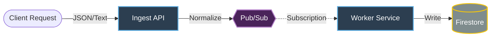

# **Robust Data Processor — Backend Task**

This project is a serverless log ingestion pipeline built on **Google Cloud Platform (GCP)**.  
It’s designed to handle **high‑volume log traffic (1,000+ RPM)**, support both JSON and text formats, and process everything asynchronously through a clean, event‑driven architecture.

The system separates workloads clearly: the API focuses on fast ingestion, while workers handle all processing in the background. Firestore sub‑collections are used to keep tenant data isolated, and Pub/Sub provides reliable message delivery even when failures occur.

---

## Live API Endpoint

**POST**  
`https://ingest-api-591662268404.us-central1.run.app/ingest`

---

## Testing the API 

### **1. JSON Log Example**

```bash
curl -X POST https://ingest-api-591662268404.us-central1.run.app/ingest \
  -H "Content-Type: application/json" \
  -d '{"tenant_id": "acme_corp", "log_id": "test-001", "text": "System accessed by user 123"}'
```

### **2. Plain Text Log Example (tenant passed via header)**

```bash
curl -X POST https://ingest-api-591662268404.us-central1.run.app/ingest \
  -H "Content-Type: text/plain" \
  -H "X-Tenant-ID: beta_inc" \
  -d "Raw log dump from legacy system 456"
```

---

## System Architecture

The pipeline uses an event‑driven setup where ingestion and processing run as independent services. This keeps the API responsive even under heavy load.


---

## How the Pipeline Works

### **1. Ingestion (API)**
- Accepts JSON or plain text logs.
- Determines the tenant:
  - JSON → pulled from request body  
  - Text → taken from `X-Tenant-ID`  
- Normalizes the log.
- Publishes to Pub/Sub.
- Returns **202 Accepted** right away to avoid blocking.

### **2. Message Buffering (Pub/Sub)**
- Stores messages durably.
- Ensures at‑least‑once delivery.
- Absorbs spikes in traffic without slowing down the API.

### **3. Worker Processing**
- Receives messages through a push subscription.
- Simulates CPU‑heavy work using a small delay based on log size.
- Writes processed logs to Firestore.

### **4. Firestore Storage**
Per‑tenant sub‑collections keep data cleanly separated:

```
tenants/{tenant_id}/processed_logs/{log_id}
```

---

## Reliability & Failure Handling

The system is built to handle worker crashes or high‑latency situations without losing data.

### Pub/Sub handles:
- Message redelivery when a worker fails or times out  
- Long acknowledgement windows (600s)  
- Guaranteed delivery until the worker successfully completes processing  

No custom retry logic is required—Pub/Sub takes care of recovery.

---

## Multi‑Tenant Separation

Firestore sub‑collections allow each tenant’s data to live in its own space, which helps with:

- Better security rule enforcement  
- Isolation between tenants  
- Reduced risk of “noisy neighbor” slowdowns  

---

## Tech Stack

| Component | Technology |
|----------|------------|
| **Language** | Python 3.10 |
| **Framework** | FastAPI |
| **Compute** | Google Cloud Run |
| **Broker** | Google Cloud Pub/Sub |
| **Database** | Google Cloud Firestore |
