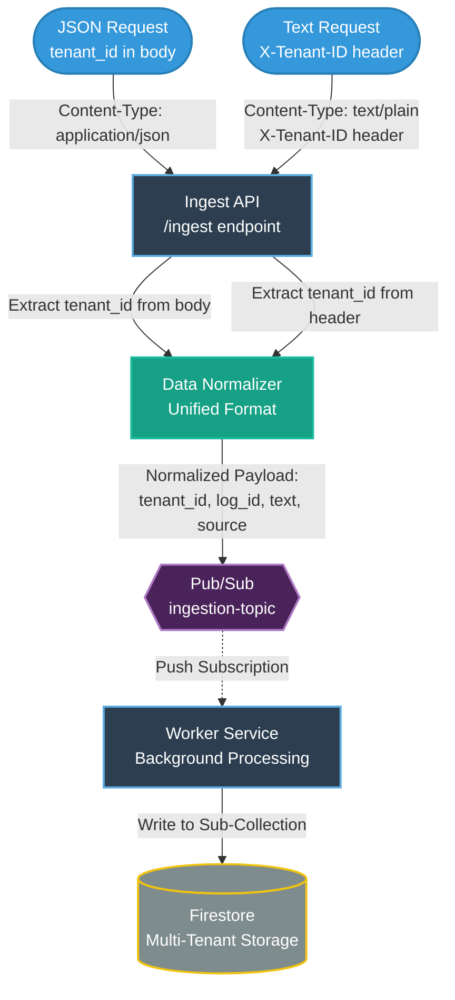

# **Robust Data Processor — Backend Task**

This project is a serverless log ingestion pipeline built on **Google Cloud Platform (GCP)**.  
It’s designed to handle **high‑volume log traffic (1,000+ RPM)**, support both JSON and text formats, and process everything asynchronously through a clean, event‑driven architecture.

The system separates workloads clearly: the API focuses on fast ingestion, while workers handle all processing in the background. Firestore sub‑collections are used to keep tenant data isolated, and Pub/Sub provides reliable message delivery even when failures occur.

---

## Live API Endpoint

**POST**  
`https://ingest-api-591662268404.us-central1.run.app/ingest`

---

## Testing the API 

### **1. JSON Log Example**

```bash
curl -X POST https://ingest-api-591662268404.us-central1.run.app/ingest \
  -H "Content-Type: application/json" \
  -d '{"tenant_id": "acme_corp", "log_id": "test-001", "text": "System accessed by user 123"}'
```

### **2. Plain Text Log Example (tenant passed via header)**

```bash
curl -X POST https://ingest-api-591662268404.us-central1.run.app/ingest \
  -H "Content-Type: text/plain" \
  -H "X-Tenant-ID: beta_inc" \
  -d "Raw log dump from legacy system 456"
```

---

## System Architecture

The pipeline uses an event‑driven setup where ingestion and processing run as independent services. This keeps the API responsive even under heavy load.



### Architecture Diagram: How JSON and TXT Paths Merge

The diagram above shows how two different input formats converge into a single unified processing pipeline:

1. **JSON Path** (Left): JSON requests contain `tenant_id` in the request body. The API extracts it directly.
2. **Text Path** (Right): Plain text requests require the `X-Tenant-ID` header to identify the tenant.
3. **Merge Point**: Both paths converge at the **Data Normalizer** within the API, which creates a unified internal format:
   ```json
   {
     "tenant_id": "...",
     "log_id": "...",
     "text": "...",
     "source": "json_upload" or "text_upload"
   }
   ```
4. **Unified Pipeline**: After normalization, both formats follow the same path through Pub/Sub, Worker, and into Firestore sub-collections.
---

## How the Pipeline Works

### **1. Ingestion (API)**
- Accepts JSON or plain text logs.
- Determines the tenant:
  - JSON → pulled from request body  
  - Text → taken from `X-Tenant-ID`  
- Normalizes the log.
- Publishes to Pub/Sub.
- Returns **202 Accepted** right away to avoid blocking.

### **2. Message Buffering (Pub/Sub)**
- Stores messages durably.
- Ensures at‑least‑once delivery.
- Absorbs spikes in traffic without slowing down the API.

### **3. Worker Processing**
- Receives messages through a push subscription.
- Simulates CPU‑heavy work using a small delay based on log size.
- Writes processed logs to Firestore.

### **4. Firestore Storage**
Per‑tenant sub‑collections keep data cleanly separated:

```
tenants/{tenant_id}/processed_logs/{log_id}
```

---

## Reliability & Failure Handling

The system is built to handle worker crashes or high‑latency situations without losing data.

### Pub/Sub handles:
- Message redelivery when a worker fails or times out  
- Long acknowledgement windows (600s)  
- Guaranteed delivery until the worker successfully completes processing  

No custom retry logic is required—Pub/Sub takes care of recovery.

---

## Crash Simulation & Retry Mechanism

To demonstrate the system's resilience, I implemented a crash simulation mechanism that tests Pub/Sub's automatic retry behavior.

### How It Works

The worker contains a crash simulation feature (in `processor-worker/worker.py`) that can be triggered by including the text `"FAIL_FIRST_TIME"` in a log entry:

```python
if "FAIL_FIRST_TIME" in text_content:
    if not os.path.exists("./temporary_data"):
        print("Attempting to crash worker (First run)...")
        os.makedirs("./temporary_data", exist_ok=True) 
        raise ValueError("Intentional crash to test retry mechanism!")
    else:
        print("Resume: Crash marker found, proceeding with job completion.")
```

### The Retry Flow

1. **First Attempt (Crash)**:
   - Worker receives message with `"FAIL_FIRST_TIME"` text
   - Checks if marker file exists → doesn't exist yet
   - Creates marker file: `./temporary_data`
   - Raises an exception → worker crashes
   - **Pub/Sub doesn't receive acknowledgment**

2. **Pub/Sub Automatic Retry**:
   - After acknowledgment deadline (600s) expires, Pub/Sub detects no acknowledgment
   - Pub/Sub automatically redelivers the same message
   - No custom retry code needed

3. **Second Attempt (Success)**:
   - Worker receives the redelivered message
   - Checks if marker file exists → **now exists**
   - Recognizes this is a retry after crash
   - Proceeds with normal processing → writes to Firestore
   - **Pub/Sub receives acknowledgment** → message removed from queue

### Why This Approach?

**Advantages:**
- **No custom retry logic**: Pub/Sub's built-in retry mechanism handles everything
- **Guaranteed delivery**: Messages are never lost, even if workers crash multiple times
- **Simple implementation**: Just raise an exception and let Pub/Sub handle the rest
- **Proves resilience**: Demonstrates the system recovers from failures automatically

**Marker File Purpose:**
The `./temporary_data` directory serves as a state marker, allowing the worker to distinguish between the first (failed) attempt and subsequent (retry) attempts. Without it, the worker would crash infinitely on every retry.

### Testing the Crash Simulation

Send a request with the crash trigger:

```bash
curl -X POST https://ingest-api-591662268404.us-central1.run.app/ingest \
  -H "Content-Type: application/json" \
  -d '{"tenant_id": "acme_corp", "log_id": "crash-test-001", "text": "FAIL_FIRST_TIME This log will crash the worker on first attempt"}'
```

After ~30 seconds (allowing for the retry), check Firestore to see the log was successfully processed after the automatic retry.

---

## Multi‑Tenant Separation

Firestore sub‑collections allow each tenant’s data to live in its own space, which helps with:

- Better security rule enforcement  
- Isolation between tenants  
- Reduced risk of “noisy neighbor” slowdowns  

---

## Tech Stack

| Component | Technology |
|----------|------------|
| **Language** | Python 3.10 |
| **Framework** | FastAPI |
| **Compute** | Google Cloud Run |
| **Broker** | Google Cloud Pub/Sub |
| **Database** | Google Cloud Firestore |
